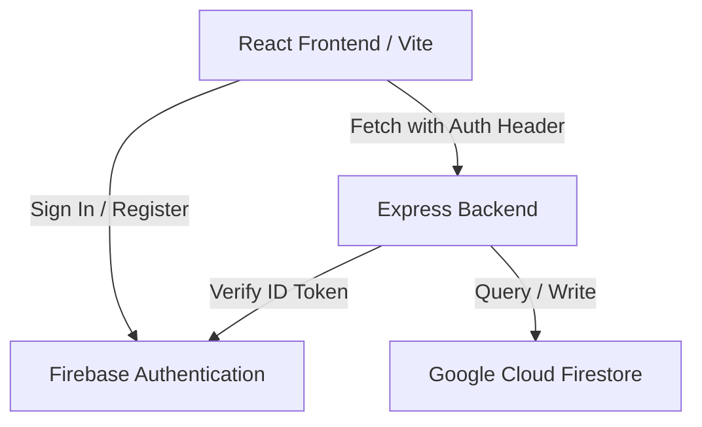

# Mini HCM Time Tracking System

A production-quality Mini Human Capital Management (HCM) Time Tracking and Attendance System. This project features a React (Vite) frontend, an Express (Node.js) backend, and a Firebase (Firestore + Firebase Authentication) database layer.

---

## Table of Contents
1. [Architecture Overview](./README.md#architecture-overview)
2. [Data Model](./README.md#data-model)
3. [Setup & Installation](./README.md#setup--installation)
4. [Running the Application](./README.md#running-the-application)
5. [Testing the Computation Engine](./README.md#testing-the-computation-engine)
6. [Testing the Full Application](./README.md#testing-the-full-application)
7. [Design & Technical Assumptions](./README.md#design--technical-assumptions)

---

## Architecture Overview



### Components
*   **Client (Vite + React)**: Presentational UI components, custom React hooks for state coordination (`useAuth`, `useAttendance`, `useDailySummary`), and Firebase Web SDK wrapper for client-side Auth.
*   **Server (Node.js + Express)**: Gated API endpoints protected by token verification and role authorization middleware. Wires Firestore queries and hands parameters to the pure computation engine.
*   **Computation Engine (`server/src/logic/computeDailySummary.js`)**: Isolated pure mathematical function that calculates regular hours, overtime, night differential, late minutes, and undertime minutes from punch times and schedules.
*   **Database (Firestore)**: Document-store database containing tables for user profiles, chronological raw attendance punch records, and calculated daily summaries.

---

## Data Model

### Collection: `users`
*   Document ID: `{uid}` (matching Firebase Auth UID)
```json
{
  "name": "string",
  "email": "string",
  "role": "employee | admin",
  "timezone": "string",
  "schedule": {
    "start": "HH:mm",
    "end": "HH:mm"
  }
}
```

### Collection: `attendance`
*   Document ID: `{autoId}`
```json
{
  "userId": "string",
  "timestamp": "Firestore Timestamp",
  "type": "in | out"
}
```

### Collection: `dailySummary`
*   Document ID: `{userId}_{date}` (e.g. `YE4JrsqQV3hhFQGAsXvwMflzAFG2_2026-07-03`)
```json
{
  "userId": "string",
  "date": "YYYY-MM-DD",
  "regularHrs": 0.00,
  "ot": 0.00,
  "nd": 0.00,
  "lateMinutes": 0,
  "undertimeMinutes": 0,
  "incomplete": false
}
```

---

## Setup & Installation

### Prerequisites
*   Node.js (v18+)
*   Firebase Project (with Authentication and Firestore Enabled)

### 1. Repository Configuration
Clone the repository and set up configuration files:

#### Client Environment Setup (`client/.env`)
Create `client/.env` matching the template:
```env
VITE_FIREBASE_API_KEY=your-api-key
VITE_FIREBASE_AUTH_DOMAIN=your-project.firebaseapp.com
VITE_FIREBASE_PROJECT_ID=your-project-id
VITE_FIREBASE_STORAGE_BUCKET=your-project.firebasestorage.app
VITE_FIREBASE_MESSAGING_SENDER_ID=your-sender-id
VITE_FIREBASE_APP_ID=your-app-id
VITE_API_BASE_URL=/api
```

#### Server Environment Setup (`server/.env`)
Create `server/.env` matching the template:
```env
PORT=5000
SERVICE_ACCOUNT_PATH=./serviceAccountKey.json
```

### 2. Place Firebase Admin Service Account Key
Download your Firebase Admin SDK service account private key JSON file from the Firebase Console, rename it to `serviceAccountKey.json`, and place it in the `server/` directory:
```
mini-hcm/server/serviceAccountKey.json
```
*Note: This file is added to `.gitignore` and will never be committed.*

> [!IMPORTANT]
> **Firestore Composite Indexes**: Certain database query combinations (e.g. searching attendance logs by `userId` and sorting by `timestamp` ascending) require composite indexes. If you encounter a `FAILED_PRECONDITION: query requires an index` error in the server console, simply copy and click the link provided in the Node.js/Express terminal logs to automatically create the index in your Firebase Console.

---

## Running the Application

### 1. Install Dependencies
Run npm install in both workspaces:
```bash
# Set up server
cd server
npm install

# Set up client
cd ../client
npm install
```

### 2. Start Servers in Development Mode

#### Server (Starts on http://localhost:5000)
```bash
cd server
npm run dev
```

#### Client (Vite Dev Server)
```bash
cd client
npm run dev
```

---

## Testing the Computation Engine
The computation engine is fully isolated and unit-tested via the native Node.js test runner.

Run the test suite inside the `server/` directory:
```bash
cd server
npm test
```
The suite runs 15 validation test cases covering overnight boundaries, late offset OT, ND window intersections, and defensive missing/invalid input handling.

---

## Testing the Full Application

Follow this manual checklist to verify the end-to-end functionality of the application:

### 1. Register a Test Employee
1. Navigate to `http://localhost:5173/register` in your web browser.
2. Fill out the registration form with a name, email, and password.
3. Submit the form. This will create a Firebase Authentication user account and automatically request the backend to register the user doc in the Firestore `users` collection.
4. You will be redirected to the **Employee Dashboard**.

### 2. Promote a User to Admin (Console Step-by-Step)
By design, all self-registrations default to `role: employee`. To test the admin dashboard features, you must promote an account manually:
1. Open the [Firebase Console](https://console.firebase.google.com/).
2. Select your Firebase Project (`mini-hcm-f4775`).
3. Click on **Firestore Database** in the left sidebar.
4. Locate the `users` collection and click on the document matching the UID of the user you want to promote (you can verify the UID from the Firebase Auth tab).
5. Double-click the `role` field value, change it from `"employee"` to `"admin"`, and click **Update**.
6. On the client, sign out and sign back in with that account. React Router will automatically route you to the **Admin Dashboard** instead of the employee view.

### 3. Manual Test Checklist
- [ ] **Register Employee**: Complete the registration flow and verify the Firestore doc is created under `users/{uid}` with `role: "employee"` and default schedule times.
- [ ] **Punch In**: On the Employee Dashboard, click **Punch In**. Verify that a document is added to the `attendance` collection with type `"in"`. The dashboard status indicator should change to green ("Currently punched in") and the button should show "Punch Out".
- [ ] **Refresh State**: Refresh the page while punched in. Verify that the dashboard preserves the punch-in state (the button remains "Punch Out").
- [ ] **Punch Out**: Click **Punch Out**. Verify that an `"out"` document is created, the button transitions to a disabled "Done for today", and today's KPI cards (Regular Hours, Overtime, ND, etc.) automatically load the computed metrics.
- [ ] **Verify dailySummary**: Go to your Firestore Console and confirm that a document with ID `${userId}_${YYYY-MM-DD}` was written to the `dailySummary` collection with the correct calculations.
- [ ] **Access Gate Verification**: Try navigating to `http://localhost:5173/admin` as an employee. React Router should automatically bounce you back to `/dashboard`.
- [ ] **Admin Reports**: Log in with your promoted Admin account. Verify that the **Daily Report** lists the employee metrics for today, and the **Weekly Report** displays the aggregate sum correctly.
- [ ] **Admin Overrides**: Select an employee in the Admin Directory, click **+ Add Punch** or **Edit** on a punch log, change the time, and click **Save & Compute**. Check that the employee's `dailySummary` values update automatically.

---

## Design & Technical Assumptions

1.  **Lunch Break & Multi-Session Punches**:
    *   By design and scope constraint, employees are allowed only **one Punch In and one Punch Out per day**. 
    *   No multi-session shifts (e.g. clocking out for lunch and clocking back in) are supported.
2.  **Admin Account Self-Registration**:
    *   There is no public path to self-register as an administrator. 
    *   All self-registered users are assigned `role: "employee"` and default schedule `09:00-18:00` server-side, ignoring client body inputs. 
    *   Admins must be provisioned manually by changing the `role` field to `"admin"` directly in the Firestore console.
3.  **Admin Punch Activity & Report Exclusion**:
    *   Admin accounts are not expected to have punch/attendance records in normal operation, since the Punch In/Out UI only renders on the Employee Dashboard for accounts with `role: employee`. 
    *   Any `dailySummary` records belonging to an admin account are excluded from the reports (Daily/Weekly) by design.
4.  **No Punch-In (Non-Work Days)**:
    *   No summaries are automatically generated for days with no punches (weekends, holidays, or leaves of absence). 
    *   A zeroed summary is only written to Firestore if a computation is explicitly requested for that day (e.g., manual admin audit request).
5.  **Overnight Shifts (Crossing Midnight)**:
    *   If `schedule.end` is numerically less than `schedule.start` (e.g., `22:00` to `06:00`), the shift is treated as crossing midnight. 
    *   The engine dynamically aligns the schedule start and end dates to match the closest calendar date relative to `punchIn`.
6.  **Missing Punch-Outs**:
    *   If a user fails to punch out (`punchOut: null`), the summary is marked as `incomplete: true`. 
    *   `lateMinutes` is computed normally (as it only requires `punchIn`), but all other metrics (`regularHrs`, `ot`, `nd`, `undertimeMinutes`) are zeroed out until the punch is updated by an administrator.
7.  **Overtime & Night Differential (ND) Window**:
    *   Night Differential is defined as work performed between `22:00` and `06:00`. 
    *   ND is calculated independently of regular or OT classification; any minute worked inside the `22:00–06:00` window increases the ND count regardless of whether it represents standard or overtime hours.
    *   Overtime starts at `max(punchIn, schedule.end)` to ensure that late clock-ins do not generate unworked overtime hours between `schedule.end` and the actual punch-in.
